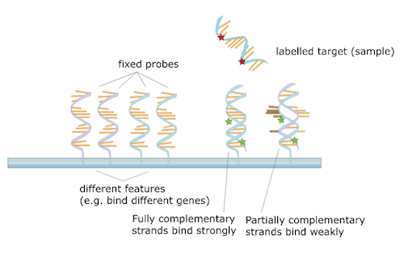

### Hierarchical Modeling for RNA-seq

Michael Love

Dept of Biostatistics

Dept of Genetics

---

## Why measure RNA

---

## Step back: pre-sequencing

* Before sequencing was microarray
* Signal was captured light (positive, "continuous")

 

---

## Motivating problem

* Measure gene expression for N genes, and M samples
* log of gene expression values are in a tall matrix X
* log here is convenient because gene expression is non-negative and has a
  long tail
* 2 equal sized groups of samples A and B

 

$$
\begin{align}
X_{ij} &\sim N(\mu_{ij}, \sigma_i) \\
\mu_{ij} &= \mu_{i0}, \quad j \in A \\
\mu_{ij} &= \mu_{i0} + \delta_i, \quad j \in B
\end{align}
$$

 

$\delta_i \ne 0$ implies DE (differential expression)

---

## Goal of differential expression testing

* Find a set of genes for which $\delta_i \ne 0$
* And which obeys false discovery rate bounds
* For G genes in our set at FDR threshold z

 

$$
E(\sum_i 1_{ \{\delta_i = 0\} }) \le G z
$$

---

## Is this realistic?

* Can we accomplish this if all $\delta_i \ne 0$
  - no, because methods rely on computational normalization
* Are any $\delta_i = 0$? 
  - maybe not, but many are very small

