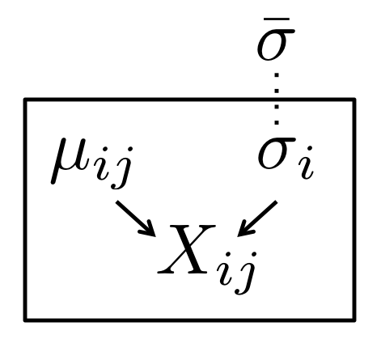
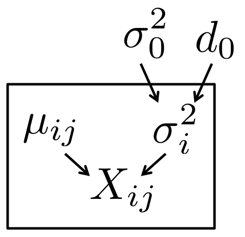

### Hierarchical Modeling for RNA-seq

<br>

Michael Love

Dept of Biostatistics

Dept of Genetics

---

### DNA => RNA


---

### Why measure RNA: 
### molecular phenotype


---

### Why measure RNA: 
### tissue diversity


<small>[Roadmap Epigenomics](http://www.roadmapepigenomics.org)</small>

---

### Why measure RNA: 
### tissue diversity


<small>[GTEx](http://www.gtexportal.org/home/)</small>

---

### Why measure RNA:
### within tissue over time


<small>[Zhang, et al. Circadian gene expression atlas (2014)](http://www.pnas.org/content/111/45/16219.full)</small>

---

### Why measure RNA: 
### discover disease sub-types


<small>[Perou, et al. Molecular portraits of human breast tumours (2000)](http://www.nature.com/nature/journal/v406/n6797/full/406747a0.html)</small>

---

### Step back: pre-sequencing

* Before sequencing was microarray
* Signal was captured light (positive, "continuous")

 


---

### Motivating problem

* Gene expression for *i*=1,...,N genes and *j*=1,...,M samples
* log of gene expression values are in a tall matrix X
* log here is convenient because gene expression is non-negative and has a
  long tail
* 2 equal sized groups of samples A and B

<br>

$$
\begin{aligned}
X_{ij} &\sim N(\mu_{ij}, \sigma_i) \\
\mu_{ij} &= \mu_{i0}, \quad j \in A \\
\mu_{ij} &= \mu_{i0} + \delta_i, \quad j \in B
\end{aligned}
$$

<br>

$\delta_i \ne 0$ implies DE (differential expression)

---

### Note $\sigma_i$

This is *critical*: different genes *i* have different amount of variability.

<br>

$$ 
\begin{aligned}
X_{ij} &\sim N(\mu_{ij}, \sigma_i) \\
\mu_{ij} &= \mu_{i0}, \quad j \in A \\
\mu_{ij} &= \mu_{i0} + \delta_i, \quad j \in B
\end{aligned}
$$

---

### Goal of differential expression testing

* Find a set of genes for which $\delta_i \ne 0$
* And which obeys false discovery rate bounds
* For genes in our set G at FDR threshold z

<br>

$$
E \left( \sum\nolimits_{i \in G} 1_{ \{\delta_i = 0\} } \right) \le
\left\vert G \right\vert z
$$

---

### Is this realistic?

* Can we accomplish this if all $\delta_i \ne 0$
  - no, because methods often rely on global scaling normalization
* Are any $\delta_i = 0$? 
  - maybe not, but many are very small for controlled experiment

---

### Is this realistic?

* What about $\sigma_i$ for both groups?
  - often this is enough, larger variance dominates
  - not for single cell experiments
* More complex parametric models: [baySeq](bioconductor.org/packages/baySeq)
* Non-parametric: [SAM / SAMseq](http://statweb.stanford.edu/~tibs/SAM/)

---

### Back to the model

$$
\begin{aligned}
X_{ij} &\sim N(\mu_{ij}, \sigma_i) \\
\mu_{ij} &= \mu_{i0}, \quad j \in A \\
\mu_{ij} &= \mu_{i0} + \delta_i, \quad j \in B
\end{aligned}
$$

<br>

* N = 5000, M = 6
* $\delta_i = 0$ for 90%
* $\delta_i = \pm2$ for 10%
* $\sigma_i \sim \Gamma(10,10)$ 

---

### Distribution of $\sigma_i$

```{r sigmadist, echo=FALSE, message=FALSE}
set.seed(1)
M <- 6
N <- 5000
mu0 <- rep(0, N)
mu1 <- delta <- sample(c(0,2,-2), N, TRUE, prob=c(.9,.05,.05))
sigma <- rgamma(N,10,10)
library(rafalib)
bigpar()
hist(sigma, xlab=expression(sigma[i]),
     col="grey", border="white", main="")
```

---

### Try simple row t-tests

```{r boxt, echo=FALSE}
X <- matrix(rnorm(N*M,
                  c(rep(mu0,M/2),rep(mu1,M/2)),
                  sigma),ncol=M)
library(genefilter)
cond <- factor(rep(2:1, each=M/2))
ts <- rowttests(X, cond)
bigpar()
boxplot(ts$statistic ~ delta,
        xlab=expression(delta[i]),
        ylab=expression(t[i]))
```

---

### Just looking at ranks

* Black = t-statistics, grey = random order, X = nominal FDR 20%

```{r roc, echo=FALSE}
abs.t <- abs(ts$statistic)
tseq <- seq(from=0,to=max(abs.t),length=400)
curve <- function(rank) {
  res <- t(sapply(tseq, function(t) {
    fdr <- mean(delta[rank >= t] == 0)
    sens <- mean(rank[delta != 0] > t)
    c(FDR=fdr, sensitivity=sens)
  }))
}
bigpar()
plot(curve(abs.t), type="o", pch=16, xlim=c(0,1), ylim=c(0,1))
lines(curve(sample(abs.t,N)), type="o", pch=16, col="grey")
# draw an FDR of 0.2
calcFDRSens <- function(padj, abs.t, fdr) {
  padj.cut <- sort(padj)[which(sort(padj) > fdr)[1] - 1]
  t.cut <- min(abs.t[padj == padj.cut])
  fdr <- mean(delta[abs.t >= t.cut] == 0)
  sens <- mean(abs.t[delta != 0] > t.cut)
  c(fdr=fdr,sens=sens)
}
padj <- p.adjust(ts$p.value, method="BH")
res <- calcFDRSens(padj, abs.t, 0.2)
points(res[1], res[2], pch=4, cex=3, lwd=3, col="magenta")
```

---

### Characterize the false positives

Call $\textrm{med}(t) \equiv \textrm{median}( \left| t_i \right| )$ for $i$ s.t. $\delta_i \ne 0$

```{r mediant, echo=FALSE}
med.t <- median(abs.t[delta != 0])
bigpar()
boxplot(abs(ts$statistic) ~ abs(delta),
        xlab=expression(abs(delta[i])),
        ylab=expression(abs(t[i])))
abline(h=med.t,col="red")
```

---

### Estimates of $\sigma_i$

$\textrm{med}(t) \equiv \textrm{median}( \left| t_i \right| )$ for $i$ s.t. $\delta_i \ne 0$

```{r fp, echo=FALSE, fig.width=14}
sigma.hat <- ts$dm / (ts$statistic * sqrt(4/M))
transgrey <- rgb(.2,.2,.2,.2)
bigpar(1,2, mar=c(5,6,3,2))
plot(sigma, sigma.hat, main="all genes",
     xlab=expression(sigma[i]), ylab=expression(hat(sigma[i])),
     col=ifelse(delta != 0, "dodgerblue", transgrey))
legend("topright",c("null","DE"),pch=1,
       col=c("grey","dodgerblue"),cex=2,bg="white")
plot(sigma[delta == 0], sigma.hat[delta == 0],
     main="null genes",
     xlab=expression(sigma[i]), ylab=expression(hat(sigma[i])),
     col=ifelse(abs.t[delta == 0] > med.t, "red", transgrey))
legend("topright",c(expression(abs(t[i])<med(t)),expression(abs(t[i])>med(t))),pch=1,
       col=c("grey","red"),cex=2,bg="white")
```

---

### New estimator for $\sigma_i$

$\bar{\sigma} = \frac{1}{N} \sum_{i=1}^N \hat{\sigma}_i$

$\tilde{\sigma}_i^B \equiv B \bar{\sigma} + (1-B) \hat{\sigma}_i$

```{r tildesigma, echo=FALSE, fig.width=4, fig.height=4}
bigpar(mar=c(5,6,1,1))
plot(sigma.hat, sigma.hat, asp=1,
     xlab=expression(hat(sigma[i])),
     ylab=expression(tilde(sigma)[i]^B))
cols <- c("purple","red","orange","green3")
for (i in 1:4) {
  B <- i/4 
  sigma.tilde <- B * mean(sigma.hat) + (1 - B) * sigma.hat
  points(sigma.hat, sigma.tilde, asp=1, col=cols[i])
}
```

---

### New estimator performance by rank
```{r roc2, echo=FALSE}
bigpar()
plot(curve(abs.t), type="o", pch=16, xlim=c(0,1), ylim=c(0,1))
for (i in 1:4) {
  B <- i/4 
  sigma.tilde <- B * mean(sigma.hat) + (1 - B) * sigma.hat
  new.t <- ts$dm / (sigma.tilde * sqrt(4/M))
  lines(curve(abs(new.t)), type="o", pch=16, col=cols[i])
}
legend("bottomright",paste0("B=",0:4/4),col=c("black",cols),pch=16,lty=1)
```

---

### Summary

* Top false positives were coming from genes with too low $\hat{\sigma}_i$
* Replace $\hat{\sigma}_i$ with an estimate which is closer to
  $\bar{\sigma}$
* Depending on "close", new estimator dominates at all thresholds

---

### How is this hierarchical?

Not your standard diagram, need to formalize



---

### limma

* Smyth, G. K. (2004) Linear models and empirical Bayes methods for
assessing differential expression in microarray experiments 
[PDF](http://www.statsci.org/smyth/pubs/ebayes.pdf)
* Developed the hierarchical model introduced by Lonnstedt and Speed
  (2002) for single sample into method for any experiment represented
  as linear model

<br>

$$
\frac{1}{\sigma^2_i} \sim \frac{1}{d_0 \sigma_0^2} \chi_{d0}^2 
$$

<br>


---

### Why inverse $\chi^2$?

* Conjugacy provides closed form solution
* Posterior mean for $1/\sigma_i^2$ given $\hat{\sigma}_i^2$ is
  $1/\tilde{\sigma}_i^2$ with

<br>

$$
\tilde{\sigma}_i^2 = \frac{d_0 \hat{\sigma}_0^2 + d_i \hat{\sigma}_i^2}{d_0 + d_i} 
$$

And $d_i$ as the standard residual degrees of freedom

---

### Note that $d_0$ controls B

$$
\begin{aligned}
\tilde{\sigma}_i^2 &= \frac{d_0 \hat{\sigma}_0^2 + d_i
\hat{\sigma}_i^2}{d_0 + d_i}  \\
 &= \left( \frac{d_0}{d_0 + d_i} \right) \hat{\sigma}_0^2 +
\left( \frac{d_i}{d_0 + d_i} \right) \hat{\sigma}_i^2 \\
 &= B \hat{\sigma}_0^2 + (1-B) \hat{\sigma}_i^2
\end{aligned}
$$

---

### Proper hierarchical model



---

### Estimation of hyperparameters

* Need to estimate $d_0, \hat{\sigma}_0^2$, which control strength and
location of *shrinkage* or *moderation*
* $d_0, \hat{\sigma}_0^2$ estimated via first two moments of $\log \hat{\sigma}_i^2$
* (Also need to estimate $\upsilon_{0}$, another parameter giving
  variance of coefficients)

---

### limma vs. naive estimators by rank

```{r echo=FALSE}
library(limma)
design <- model.matrix(~cond)
fit <- lmFit(X, design)
eb <- ebayes(fit)
limma.t <- eb$t[,2]
```

```{r roc3, echo=FALSE}
bigpar()
plot(curve(abs.t), type="o", pch=16, xlim=c(0,1), ylim=c(0,1))
for (i in 1:2) {
  B <- i/4
  sigma.tilde <- B * mean(sigma.hat) + (1 - B) * sigma.hat
  new.t <- ts$dm / (sigma.tilde * sqrt(4/M))
  lines(curve(abs(new.t)), type="o", pch=16, col=cols[i])
}
lines(curve(abs(limma.t)), type="o", pch=16, col="dodgerblue")
legend("bottomright",c(paste0("B=",0:2/4),"limma"),
       col=c("black",cols[1:2],"dodgerblue"),pch=16,lty=1)
```

---

### Rank is not the full picture

* limma also estimating degrees of freedom gained
* X = nominal FDR 20%

```{r roc4, echo=FALSE}
bigpar()
plot(curve(abs.t), type="o", pch=16, xlim=c(0,1), ylim=c(0,1))
lines(curve(abs(limma.t)), type="o", pch=16, col="dodgerblue")
# draw FDR of 0.2
padj <- p.adjust(ts$p.value, method="BH")
res <- calcFDRSens(padj, abs.t, 0.2)
points(res[1], res[2], pch=4, cex=3, lwd=3, col="magenta")
padj <- p.adjust(eb$p.value[,2], method="BH")
res <- calcFDRSens(padj, abs(limma.t), 0.2)
points(res[1], res[2], pch=4, cex=3, lwd=3, col="blue")
legend("bottomright",c("t","limma"),
       col=c("black","dodgerblue"),pch=16,lty=1)
```


---

### RNA-seq: counting molecules


---

### RNA-seq: counting molecules

<br>

```
@SRR1265495.1 1/1
CTTTGCCCGCGTGTCAGACTCCATCCCTCCTCTGCCGCCACCGCAGCAGCCACAGGCAGAGGAGGACGAGGACGACTGGGAATCGTAGGGGGCTCCATGAC
+
CCCFFFFFHGFHHHIJJIJIJJIJJJJJJJGIIJJJIJJJJJJJJEFHDEFFFEECDDDBDD?BB?B@BDDD@;9<BBBDBCB@A2<?BDDDBDBD@CDDC
@SRR1265495.2 2/1
CCTGGCTGTGTCCATGTCAGAGCAATGGCCCAAGTCTGGGTCTGGGGGGGAAGGTGTCATGGAGCCCCCTACGATTCCCAGTCGTCCTCGTCCTCCTCTGC
+
@C@FFFDFHHHHGGIIAGHI9GIIIIIGIIIIIGI@@FHGDDDH@GGIBB05?B>ACCCCCCCB<?BBCCBBBBCBCDC3>AC<BB<?CBBB?<@CCCA:@
@SRR1265495.3 3/1
CTGTGTCCATGTCAGAGCAATGGCCCAAGTCTGGGTCTGGGGGGGAAGGTGTCATGGAGCCCCCTACGATTCCCAGTCGTCCTCGTCCTCCTCTGCCTGTG
+
@C@DFFFFGGHDHIIEGDHCGGHIJGEHIIJIIJIEEHGIGEGDDB@@@CDDDDEDDDDDBDDDDDDDDDBCCDDCCDBBDDDDDB@?@DDDDCDDCC@4>
```

for ~30 million reads (often pairs of reads)

---

### RNA-seq: align to genome or transcriptome


---

### RNA-seq: counting molecules

* Now for each gene and each sample we can obtain a *count*
  or *estimated count* of fragments
* Why estimated? Because some fragments cannot be uniquely associated
  with genes or isoforms
* Clever and fast algorithms for probabalistically assigning these
* Assume we have integer counts $K_{ij}$ of unique fragments or from 
  rounding estimated counts

---

### Counts

1. Either model data with count distributions and inference with GLM
  - [DESeq2](https://www.ncbi.nlm.nih.gov/pubmed/25516281) (2014)
  - [edgeR](https://www.ncbi.nlm.nih.gov/pubmed/19910308) (2010)
  - many more
2. Learn weights associated with log normalized counts and use limma
  - [limma-voom](https://www.ncbi.nlm.nih.gov/pubmed/24485249) (2014)

---

### Negative Binomial / Gamma Poisson

$\textrm{NB}(\mu, \alpha)$

$\textrm{Var} = \mu + \alpha \mu^2$

```{r negbin, echo=FALSE}
bigpar(2,2, mar=c(3,3,1,1))
mu <- 10
s <- 0:(2*mu)
s2 <- (0:(mu*20))/10
plot(s,dpois(s,lambda=mu),type="b",
     xlab="",ylab="",ylim=c(0,.3), cex=1.5)
abline(v=mu, col="dodgerblue", lwd=2)
for (p in c(.8, .4, .08)) {
  plot(s, dnbinom(s,size=mu*p/(1-p),prob=p),
       type="b",xlab="",ylab="", ylim=c(0,.3), cex=1.5)
  lines(s2, dgamma(s2,shape=mu*p/(1-p),rate=p/(1-p)),
        col="dodgerblue", lwd=2)
}
```

---

### NB model for RNA-seq

Similar to our microarray model for $X_{ij}$

$$
\begin{aligned}
K_{ij} &\sim \textrm{NB}(\mu_{ij}, \alpha_i) \\
\mu_{ij} &= s_j q_ij
\end{aligned}
$$

---

### Moderation of dispersion

---

### Robust estimation of prior: excluding outliers
