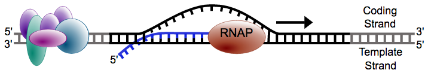
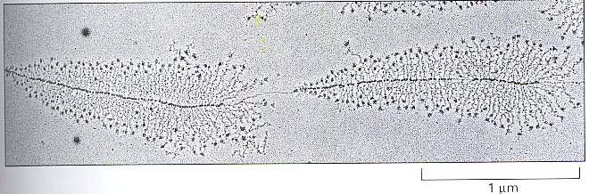
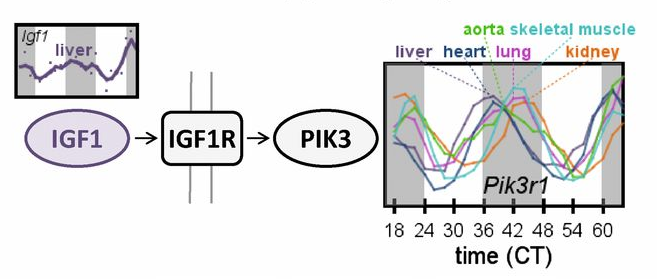

### Hierarchical Modeling for RNA-seq

Michael Love

Dept of Biostatistics

Dept of Genetics

---

### DNA => RNA





---

### Why measure RNA: 
### molecular phenotype


---

### Why measure RNA: 
### tissue diversity


<small>[Roadmap Epigenomics](http://www.roadmapepigenomics.org)</small>

---

### Why measure RNA:
### within tissue over time



<small>[Zhang, et al. Circadian gene expression atlas (2014)](http://www.pnas.org/content/111/45/16219.full)</small>

---

### Why measure RNA: 
### discover disease sub-types


<small>[Perou, et al. Molecular portraits of human breast tumours (2000)](http://www.nature.com/nature/journal/v406/n6797/full/406747a0.html)</small>

---

### Step back: pre-sequencing

* Before sequencing was microarray
* Signal was captured light (positive, "continuous")

 


---

### Motivating problem

* Measure gene expression for N genes, and M samples
* log of gene expression values are in a tall matrix X
* log here is convenient because gene expression is non-negative and has a
  long tail
* 2 equal sized groups of samples A and B

<br>

$$
\begin{align}
X_{ij} &\sim N(\mu_{ij}, \sigma_i) \\
\mu_{ij} &= \mu_{i0}, \quad j \in A \\
\mu_{ij} &= \mu_{i0} + \delta_i, \quad j \in B
\end{align}
$$

<br>

$\delta_i \ne 0$ implies DE (differential expression)

---

### Goal of differential expression testing

* Find a set of genes for which $\delta_i \ne 0$
* And which obeys false discovery rate bounds
* For G genes in our set at FDR threshold z

<br>

$$
E(\sum_i 1_{ \{\delta_i = 0\} }) \le G z
$$

---

### Is this realistic?

* Can we accomplish this if all $\delta_i \ne 0$
  - no, because methods rely on computational normalization
* Are any $\delta_i = 0$? 
  - maybe not, but many are very small for controlled experiment

---

### Is this realistic?

* What about $\sigma_i$ for both groups?
  - often this is enough, larger variance dominates
  - not for single cell experiments
* More complex parametric models: [baySeq](bioconductor.org/packages/baySeq)
* Non-parametric: [SAM / SAMseq](http://statweb.stanford.edu/~tibs/SAM/)

---

### Back to the model

$$
\begin{align}
X_{ij} &\sim N(\mu_{ij}, \sigma_i) \\
\mu_{ij} &= \mu_{i0}, \quad j \in A \\
\mu_{ij} &= \mu_{i0} + \delta_i, \quad j \in B
\end{align}
$$

<br>

* N = 5000, M = 6
* $\delta_i = 0$ for 90%
* $\delta_i = \pm1$ for 10%
* $\sigma_i \sim \Gamma(5,10)$ 

---

### Distribution of $\sigma_i$

```{r sigmadist, echo=FALSE}
M <- 6
N <- 5000
mu0 <- rep(0, N)
mu1 <- delta <- sample(c(0,1,-1), N, TRUE, prob=c(.9,.05,.05))
sigma <- rgamma(N,5,10)
library(rafalib)
bigpar()
hist(sigma, xlab=expression(sigma[i]),
     col="grey", border="white", main="")
```

---

### Try simple row t-tests

```{r boxt, echo=FALSE}
X <- matrix(rnorm(N*M,
                  c(rep(mu0,M/2),rep(mu1,M/2)),
                  sigma),ncol=M)
library(genefilter)
cond <- factor(rep(2:1, each=M/2))
ts <- rowttests(X, cond)
bigpar()
boxplot(ts$statistic ~ delta,
        xlab=expression(delta[i]),
        ylab=expression(t[i]))
```

---

### Just looking at ranks

```{r roc, echo=FALSE}
abs.t <- abs(ts$statistic)
tseq <- seq(from=0,to=max(abs.t),length=400)
curve <- function(rank) {
  res <- t(sapply(tseq, function(t) {
    fdr <- mean(delta[rank >= t] == 0)
    sens <- mean(rank[delta != 0] > t)
    c(FDR=fdr, sensitivity=sens)
  }))
}
bigpar()
plot(curve(abs.t), type="o", pch=16, xlim=c(0,1), ylim=c(0,1))
lines(curve(sample(abs.t,N)), type="o", pch=16, col="grey")
```
