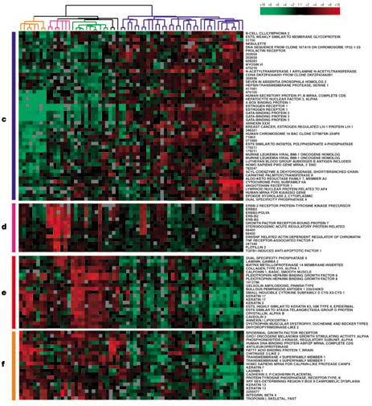
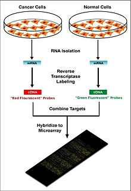
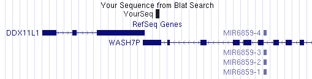
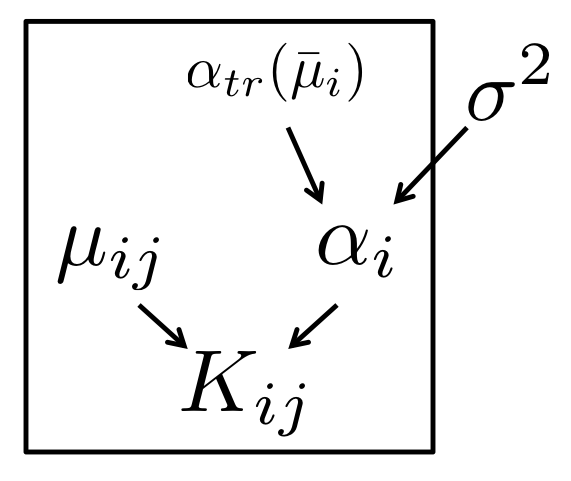

### Hierarchical Models for RNA-seq

<br>

Michael Love

Dept of Biostatistics

Dept of Genetics

---

### DNA => RNA


---

### Why measure RNA as phenotype


---

### Why measure RNA: tissue diversity


<small>[Roadmap Epigenomics](http://www.roadmapepigenomics.org)</small>

---

### Why measure RNA: tissue diversity


<small>[GTEx](http://www.gtexportal.org/home/)</small>

---

### Why measure RNA: within tissue over time


<small>[Zhang, et al. Circadian gene expression atlas (2014)](http://www.pnas.org/content/111/45/16219.full)</small>

---

### Why measure RNA:  disease sub-types



<small>[Perou, et al. Molecular portraits of human breast tumours (2000)](http://www.nature.com/nature/journal/v406/n6797/full/406747a0.html)</small>

---

### Step back: pre-sequencing

Before sequencing was microarray

 

---

### Step back: pre-sequencing

Signal was captured light (positive, "continuous")



---

### Formalize

* Formalize as a simple statistical model
* Observed data $X_{ij}$ as a R.V. following a distribution
* Distributional parameters of interest 

---

### Motivating problem

* Gene expression for *i*=1,...,N genes and *j*=1,...,M samples
* log of gene expression values are in a tall matrix X
* log here is convenient because gene expression is non-negative and has a
  long tail
* 2 equal sized groups of samples A and B

<br>

$$
\begin{aligned}
X_{ij} &\sim N(\mu_{ij}, \sigma_i) \\
\mu_{ij} &= \mu_{i0}, \quad j \in A \\
\mu_{ij} &= \mu_{i0} + \delta_i, \quad j \in B
\end{aligned}
$$

<br>

$\delta_i \ne 0$ implies DE (differential expression)

---

### Note $\sigma_i$

This is *critical*: different genes *i* have different amount of variability.

<br>

$$ 
\begin{aligned}
X_{ij} &\sim N(\mu_{ij}, \sigma_i) \\
\mu_{ij} &= \mu_{i0}, \quad j \in A \\
\mu_{ij} &= \mu_{i0} + \delta_i, \quad j \in B
\end{aligned}
$$

---

### Goal of differential expression

* Find a set of genes for which $\delta_i \ne 0$
* We want to target a false discovery rate (FDR) cutoff
* For genes in our set G at FDR threshold z

<br>

$$
E \left( \sum\nolimits_{i \in G} 1_{ \{\delta_i = 0\} } \right) \le
\left\vert G \right\vert z
$$

---

### Is this realistic?

* Can we accomplish this if all $\delta_i \ne 0$
  - no, because methods often rely on global scaling normalization
* Are any $\delta_i = 0$? 
  - maybe not, but many are very small for controlled experiment

---

### Is this realistic?

* What about $\sigma_i$ for both groups?
  - often this is enough, larger variance dominates
  - not for single cell experiments
* More complex parametric models: [baySeq](bioconductor.org/packages/baySeq)
* Non-parametric: [SAM / SAMseq](http://statweb.stanford.edu/~tibs/SAM/)

---

### Back to the model

$$
\begin{aligned}
X_{ij} &\sim N(\mu_{ij}, \sigma_i) \\
\mu_{ij} &= \mu_{i0}, \quad j \in A \\
\mu_{ij} &= \mu_{i0} + \delta_i, \quad j \in B
\end{aligned}
$$

<br>

* N = 5000, M = 6
* $\delta_i = 0$ for 90%
* $\delta_i = \pm2$ for 10%
* $\sigma_i \sim \Gamma(10,10)$ 

---

### Distribution of $\sigma_i$

```{r sigmadist, echo=FALSE, message=FALSE}
set.seed(1)
M <- 6
N <- 5000
mu0 <- rep(0, N)
mu1 <- delta <- sample(c(0,2,-2), N, TRUE, prob=c(.9,.05,.05))
sigma <- rgamma(N,10,10)
library(rafalib)
bigpar()
hist(sigma, xlab=expression(sigma[i]),
     col="grey", border="white", main="")
```

---

### Try simple row t-tests

```{r boxt, echo=FALSE}
X <- matrix(rnorm(N*M,
                  c(rep(mu0,M/2),rep(mu1,M/2)),
                  sigma),ncol=M)
library(genefilter)
cond <- factor(rep(2:1, each=M/2))
ts <- rowttests(X, cond)
bigpar()
boxplot(ts$statistic ~ delta,
        xlab=expression(delta[i]),
        ylab=expression(t[i]))
```

---

### Just looking at ranks

```{r echo=FALSE}
abs.t <- abs(ts$statistic)
tseq <- seq(from=0,to=max(abs.t),length=400)
curve <- function(rank) {
  res <- t(sapply(tseq, function(t) {
    fdr <- mean(delta[rank >= t] == 0, na.rm=TRUE)
    sens <- mean(rank[delta != 0] > t, na.rm=TRUE)
    c(FDR=fdr, sensitivity=sens)
  }))
}
# draw an FDR of 0.2
calcFDRSens <- function(padj, abs.t, fdr) {
  padj.cut <- sort(padj)[which(sort(padj) > fdr)[1] - 1]
  t.cut <- min(abs.t[padj == padj.cut])
  fdr <- mean(delta[abs.t >= t.cut] == 0)
  sens <- mean(abs.t[delta != 0] > t.cut)
  c(fdr=fdr,sens=sens)
}
padj <- p.adjust(ts$p.value, method="BH")
res <- calcFDRSens(padj, abs.t, 0.2)
```

```{r roc, echo=FALSE}
bigpar()
plot(curve(abs.t), type="o", pch=16, xlim=c(0,1), ylim=c(0,1))
set.seed(1)
lines(curve(sample(abs.t,N)), type="o", pch=16, col="grey")
points(res[1], res[2], pch=4, cex=3, lwd=3, col="red")
legend("topleft",c("t-stat","random","20% FDR"),
       col=c("black","grey","red"),
       pch=c(16,16,4), cex=1.5)
```

---

### Characterize the false positives

$$
\textrm{med}(t) \equiv \textrm{median}( \left| t_i \right| )
\, \textrm{for} \, i : \delta_i \ne 0
$$

```{r mediant, echo=FALSE}
med.t <- median(abs.t[delta != 0])
bigpar()
boxplot(abs(ts$statistic) ~ abs(delta),
        xlab=expression(abs(delta[i])),
        ylab=expression(abs(t[i])))
abline(h=med.t,col="red")
```

---

### Estimates of $\sigma_i$

$$
\textrm{med}(t) \equiv \textrm{median}( \left| t_i \right| )
\, \textrm{for} \, i : \delta_i \ne 0
$$

```{r fp, echo=FALSE, fig.width=14}
sigma.hat <- ts$dm / (ts$statistic * sqrt(4/M))
transgrey <- rgb(.2,.2,.2,.2)
bigpar(1,2, mar=c(5,6,3,2))
plot(sigma, sigma.hat, main="all genes",
     xlab=expression(sigma[i]), ylab=expression(hat(sigma[i])),
     col=ifelse(delta != 0, "dodgerblue", transgrey))
abline(0,1)
legend("topright",c("null","DE"),pch=1,
       col=c("grey","dodgerblue"),cex=2,bg="white")
plot(sigma[delta == 0], sigma.hat[delta == 0],
     main="null genes",
     xlab=expression(sigma[i]), ylab=expression(hat(sigma[i])),
     col=ifelse(abs.t[delta == 0] > med.t, "red", transgrey))
legend("topright",c(expression(abs(t[i])<med(t)),expression(abs(t[i])>med(t))),pch=1,
       col=c("grey","red"),cex=2,bg="white")
abline(0,1)
```

---

### New estimator for $\sigma_i$

$$
\begin{aligned}
\bar{\sigma} &= \frac{1}{N} \sum\nolimits_{i=1}^N \hat{\sigma}_i \\
\tilde{\sigma}_i^B &= B \bar{\sigma} + (1-B) \hat{\sigma}_i
\end{aligned}
$$

```{r tildesigma, echo=FALSE, fig.width=10, fig.height=5}
bigpar(mar=c(5,15,1,15))
plot(sigma.hat, sigma.hat, asp=1,
     xlab=expression(hat(sigma[i])),
     ylab=expression(tilde(sigma)[i]^B))
cols <- palette.colors()[2:5]
for (i in 1:4) {
  B <- i/4
  sigma.tilde <- B * mean(sigma.hat) + (1 - B) * sigma.hat
  points(sigma.hat, sigma.tilde, asp=1, col=cols[i])
}
legend("topleft",paste0("B=",0:4/4),col=c("black",cols),pch=16,lty=1,cex=1.5)
```

---

### New estimator performance by rank
```{r roc2, echo=FALSE}
bigpar()
plot(curve(abs.t), type="o", pch=16, xlim=c(0,1), ylim=c(0,1))
for (i in 1:4) {
  B <- i/4 
  sigma.tilde <- B * mean(sigma.hat) + (1 - B) * sigma.hat
  new.t <- ts$dm / (sigma.tilde * sqrt(4/M))
  lines(curve(abs(new.t)), type="o", pch=16, col=cols[i])
}
legend("bottomright",paste0("B=",0:4/4),col=c("black",cols),pch=16,lty=1,cex=1.5)
```

---

### New estimators by |t|
```{r newestmediant, echo=FALSE}
B <- 1/2
sigma.tilde <- B * mean(sigma.hat) + (1 - B) * sigma.hat
new.t <-  ts$dm / (sigma.tilde * sqrt(4/M))
bigpar(1,2)
p <- .75
boxplot(abs(ts$statistic) ~ abs(delta),
        xlab=expression(abs(delta[i])),
        ylab=expression(abs(t[i])),
        ylim=c(0,10), main="orig")
q <- quantile(abs(ts$statistic[delta != 0]),p)
abline(h=q, col="blue")
tsum <- sum(abs(ts$statistic[delta==0]) > q)
points(rep(1,tsum),abs(ts$statistic[delta==0 & abs(ts$statistic) > q]),col="blue",lwd=2)
text(1,q+.5,tsum,pos=4,col="blue")
boxplot(abs(new.t) ~ abs(delta),
        xlab=expression(abs(delta[i])),
        ylab=expression(abs(t[i])),
        ylim=c(0,10), main="B=1/2")
q <- quantile(abs(new.t[delta != 0]),p)
abline(h=q, col="blue")
tsum <- sum(abs(new.t[delta==0]) > q)
points(rep(1,tsum),abs(new.t[delta==0 & abs(new.t) > q]),col="blue",lwd=2)
text(1,q+.5,tsum,pos=4,col="blue")
```

---

### Summary

* Top false positives were coming from genes with too low $\hat{\sigma}_i$
* Replace $\hat{\sigma}_i$ with an estimate which is closer to
  $\bar{\sigma}$
* Depending on "close", new estimator dominates at all thresholds

---

### How is this hierarchical?

Not your standard diagram, need to formalize


---

### limma

* [Smyth, G. K. (2004)](http://www.statsci.org/smyth/pubs/ebayes.pdf) 
  Linear models and empirical Bayes methods for
  assessing differential expression in microarray experiments 
* Developed the hierarchical model introduced by 
  Lonnstedt and Speed (2002) for single sample into method for any
  experiment represented as linear model

<br>

$$
\frac{1}{\sigma^2_i} \sim \frac{1}{d_0 \sigma_0^2} \chi_{d0}^2 
$$

<br>


---

### Why inverse $\chi^2$?

* Conjugacy provides closed form solution
* Posterior mean for $1/\sigma_i^2$ given $\hat{\sigma}_i^2$ is
  $1/\tilde{\sigma}_i^2$ with

<br>

$$
\tilde{\sigma}_i^2 = \frac{d_0 \hat{\sigma}_0^2 + d_i \hat{\sigma}_i^2}{d_0 + d_i} 
$$

And $d_i$ as the standard residual degrees of freedom

---

### Note that $d_0$ controls B

$$
\begin{aligned}
\tilde{\sigma}_i^2 &= \frac{d_0 \hat{\sigma}_0^2 + d_i
\hat{\sigma}_i^2}{d_0 + d_i}  \\
 &= \left( \frac{d_0}{d_0 + d_i} \right) \hat{\sigma}_0^2 +
\left( \frac{d_i}{d_0 + d_i} \right) \hat{\sigma}_i^2 \\
 &= B \hat{\sigma}_0^2 + (1-B) \hat{\sigma}_i^2
\end{aligned}
$$

---

### Proper hierarchical model


---

### Estimation of hyperparameters

* Need to estimate $d_0, \hat{\sigma}_0^2$, which control strength and
location of *shrinkage* or *moderation*
* $d_0, \hat{\sigma}_0^2$ estimated via first two moments of $\log \hat{\sigma}_i^2$
* (Also need to estimate $\upsilon_{0}$, another parameter giving
  variance of coefficients)

---

### limma vs. naive estimators by rank

```{r echo=FALSE}
library(limma)
design <- model.matrix(~cond)
fit <- lmFit(X, design)
eb <- ebayes(fit)
limma.t <- eb$t[,2]
```

```{r roc3, echo=FALSE}
bigpar()
plot(curve(abs.t), type="o", pch=16, xlim=c(0,1), ylim=c(0,1))
for (i in 1:2) {
  B <- i/4
  sigma.tilde <- B * mean(sigma.hat) + (1 - B) * sigma.hat
  new.t <- ts$dm / (sigma.tilde * sqrt(4/M))
  lines(curve(abs(new.t)), type="o", pch=16, col=cols[i])
}
lines(curve(abs(limma.t)), type="o", pch=16, col="purple")
legend("bottomright",c(paste0("B=",0:2/4),"limma"),
       col=c("black",cols[1:2],"purple"),pch=16,lty=1,cex=1.5)
```

---

### Operating characteristics (FP & FN)

```{r roc4, echo=FALSE}
bigpar()
plot(curve(abs.t), type="o", pch=16, xlim=c(0,1), ylim=c(0,1))
lines(curve(abs(limma.t)), type="o", pch=16, col="purple")
# draw FDR of 0.2
padj <- p.adjust(ts$p.value, method="BH")
res <- calcFDRSens(padj, abs.t, 0.2)
points(res[1], res[2], pch=4, cex=3, lwd=3, col="red")
padj <- p.adjust(eb$p.value[,2], method="BH")
res <- calcFDRSens(padj, abs(limma.t), 0.2)
points(res[1], res[2], pch=4, cex=3, lwd=3, col="blue")
legend("bottomright",c("t","t 20% FDR","limma","limma 20% FDR"),
       col=c("black","red","purple","blue"),
       pch=c(16,4,16,4), cex=1.5)
```

---

### Summary

* limma provides a hierarchical model for moderation of
  variance estimates in the context of linear models
* Avoids false positives from under-estimation of variance
* Also addresses the gain in degrees of freedom from moderation

---

### RNA-seq: counting molecules


---

### RNA-seq: counting molecules

<br>

```
@SRR1265495.1 1/1
CTTTGCCCGCGTGTCAGACTCCATCCCTCCTCTGCCGCCACCGCAGCAGCCACAGGCAGAGGAGGACGAGGACGACTGGGAATCGTAGGGGGCTCCATGAC
+
CCCFFFFFHGFHHHIJJIJIJJIJJJJJJJGIIJJJIJJJJJJJJEFHDEFFFEECDDDBDD?BB?B@BDDD@;9<BBBDBCB@A2<?BDDDBDBD@CDDC
@SRR1265495.2 2/1
CCTGGCTGTGTCCATGTCAGAGCAATGGCCCAAGTCTGGGTCTGGGGGGGAAGGTGTCATGGAGCCCCCTACGATTCCCAGTCGTCCTCGTCCTCCTCTGC
+
@C@FFFDFHHHHGGIIAGHI9GIIIIIGIIIIIGI@@FHGDDDH@GGIBB05?B>ACCCCCCCB<?BBCCBBBBCBCDC3>AC<BB<?CBBB?<@CCCA:@
@SRR1265495.3 3/1
CTGTGTCCATGTCAGAGCAATGGCCCAAGTCTGGGTCTGGGGGGGAAGGTGTCATGGAGCCCCCTACGATTCCCAGTCGTCCTCGTCCTCCTCTGCCTGTG
+
@C@DFFFFGGHDHIIEGDHCGGHIJGEHIIJIIJIEEHGIGEGDDB@@@CDDDDEDDDDDBDDDDDDDDDBCCDDCCDBBDDDDDB@?@DDDDCDDCC@4>
```

for ~30 million reads (often pairs of reads)

---

### RNA-seq: counting molecules

Align to genome or transcriptome



---

### RNA-seq: counting molecules

* Now for each gene and each sample we can obtain a *count*
  or *estimated count* of fragments
* Why estimated? Because some fragments cannot be uniquely associated
  with genes or isoforms
* Fast algorithms for probabilistically assignment:
  - [kallisto](http://www.nature.com/nbt/journal/v34/n5/full/nbt.3519.html) (2016)
  - [Salmon](http://www.nature.com/nmeth/journal/v14/n4/abs/nmeth.4197.html) (2017)
* Assume we have integer counts $K_{ij}$ of unique fragments or from 
  rounding estimated counts

---

### Counts

1. Either model data with count distributions and inference with GLM
  - [DESeq2](https://www.ncbi.nlm.nih.gov/pubmed/25516281) (2014)
  - [edgeR](https://www.ncbi.nlm.nih.gov/pubmed/19910308) (2010)
  - many more
2. Learn weights associated with log normalized counts and use limma
  - [limma-voom](https://www.ncbi.nlm.nih.gov/pubmed/24485249) (2014)

---

### Important for statistical analysis

* Total number of fragments is technical artifact
* Heteroskedasticity of counts
* Each gene has different variability

---

### Total number of fragments

```{r totalnumber, echo=FALSE, results="hide", fig.width=14}
suppressPackageStartupMessages(library(airway))
data(airway)
bigpar(1,2)
barplot(sort(colSums(assay(airway))/1e6),names.arg=1:8,
        ylab="millions of fragments", xlab="samples")
idx <- c(which.min(colSums(assay(airway))),
         which.max(colSums(assay(airway))))
plot(assay(airway)[,idx]+1, log="xy", xlab="sample 1", ylab="sample 8")
abline(0,1,col="red",lwd=2)
```

---

### Sampling fragments

```{r sampfrags, echo=FALSE}
set.seed(1)
n <- 5e3
x <- runif(n)
y <- runif(n)
theta <- runif(n,0,2*pi)
col <- sample(rep(c("grey70","red"),n*c(.95,.05)))
par(mar=c(1,1,1,1))
nullplot(.1,.9,.1,.9,bty="n",xaxt="n",yaxt="n")
m <- runif(n,.01,.03)
segments(x,y,x+m*cos(theta),y+m*sin(theta),col=col,lwd=2)
```

---

### Poisson across technical replicates

* From [Bullard 2010](https://www.ncbi.nlm.nih.gov/pubmed?term=20167110)
  take 7 technical replicates
* Calculate expected value $\hat{\lambda}_{ij}$ using DESeq2 norm
* $P(K_{ij} < \hat{\lambda}_{ij})$ assuming $K_{ij} \sim \textrm{Pois}(\hat{\lambda}_{ij})$

```{r echo=FALSE}
url <- "http://bowtie-bio.sourceforge.net/recount/ExpressionSets/maqc_eset.RData"
file <- "maqc_eset.rda"
if (!file.exists(file)) download.file(url, file)
load(file)
library(Biobase)
library(DESeq2)
```

```{r poisson, echo=FALSE, fig.width=12, fig.height=5}
# take 7 replicates
dat <- exprs(maqc.eset)[,1:7]
# estimate DESeq column scaling
sf <- estimateSizeFactorsForMatrix(dat)
# normalized data
dat2 <- t(t(dat)/sf)
rm <- rowMeans(dat2)
# expected counts
exp.counts <- outer(rm, sf, "*")
brks <- c(1,10,25,50,100,250,500,1000,50000)
pval.counts <- matrix(NA,8,30)
for (i in 1:8) {
  idx <- rm > brks[i] & rm < brks[i+1]
  pvals <- ppois(dat[idx,], exp.counts[idx,])
  pval.counts[i,] <- hist(pvals, breaks=0:30/30, plot=FALSE)$counts
}
bigpar(mar=c(5,15,2,15))
barplot(pval.counts[8:1,], col=8:1,
        xlab="p-value", ylab="number of genes")
axis(1,c(0,36),c(0,1))
legend("topleft",paste("<",brks[-1]),fill=1:8, bg="white",
       title="row mean", ncol=2)
```

---

### However, expression not equal across biological replicates


---

### Negative Binomial / Gamma Poisson

$$
\begin{aligned}
K_{ij} &\sim \textrm{NB}(\mu_{ij}, \alpha_i) \\
\textrm{Var}(K_{ij}) &= \mu_{ij} + \alpha_i \mu_{ij}^2
\end{aligned}
$$

```{r negbin, echo=FALSE, fig.width=10, fig.height=6}
bigpar(2,3, mar=c(3,3,1,1))
mu <- 10
s <- 0:(2*mu)
s2 <- seq(from=0,to=2*mu,length=100)
plot(s,dpois(s,lambda=mu),type="b",
     xlab="",ylab="",ylim=c(0,.3), cex=1.5)
abline(v=mu, col="dodgerblue", lwd=2)
for (p in c(.8, .5, .2, .1, .05)) {
  plot(s, dnbinom(s,size=mu*p/(1-p),prob=p),
       type="b",xlab="",ylab="", ylim=c(0,.3), cex=1.5)
  lines(s2, dgamma(s2,shape=mu*p/(1-p),rate=p/(1-p)),
        col="dodgerblue", lwd=2)
}
```

---

### NB model for RNA-seq

* Similar to our microarray model for $X_{ij}$
* Added an $s_j$ to deal with sequencing depth

<br>

$$
\begin{aligned}
K_{ij} &\sim \textrm{NB}(\mu_{ij}, \alpha_i) \\
\mu_{ij} &= s_j q_{ij} \\ 
\log_2(q_{ij}) &= \beta_{i0}, \quad j \in A \\
\log_2(q_{ij}) &= \beta_{i0} + \delta_i, \quad j \in B
\end{aligned}
$$

<br>

$\delta_i \ne 0$ implies DE (differential expression)

---

### Moderation of dispersion

* In [DESeq2](https://www.ncbi.nlm.nih.gov/pubmed/25516281), a prior on $\log(\alpha_i)$
* Calculate the mean of normalized counts $\bar{\mu}_i$
* A trend line of dispersion over mean $\alpha_{tr}(\mu)$
* Width of the prior $\sigma^2$ estimated via assumption of normal
  sampling variance of $\log(\hat{\alpha}_i)$

<br>

$$
\log(\alpha_i) \sim N(\log(\alpha_{tr}(\bar{\mu}_i)), \sigma^2)
$$

---

### Moderation of dispersion



---

### Moderation of dispersion

```{r echo=FALSE}
library(airway)
data(airway)
dds <- DESeqDataSet(airway, ~dex)
dds <- dds[rowSums(counts(dds)) > 20,]
dds <- estimateSizeFactors(dds)
dds <- estimateDispersions(dds, quiet=TRUE)
```

```{r disp, echo=FALSE, fig.width=9}
bigpar()
plotDispEsts(dds, ylim=c(1e-4,10))
```

---

### Evaluate via simulation

```{r echo=FALSE}
set.seed(1)
dmr <- function(x) exp(rnorm(5000,log(0.05),.5))
delta <- sample(rep(c(0,2),5000*c(.9,.1)))
dds <- makeExampleDESeqDataSet(m=6, n=5000,
                               betaSD=delta,
                               interceptMean=10,
                               interceptSD=3,
                               dispMeanRel=dmr)
dds <- DESeq(dds, fitType="mean", quiet=TRUE)
res <- results(dds)
dds2 <- dds
dispersions(dds2) <- mcols(dds)$dispGeneEst
dds2 <- nbinomWaldTest(dds2, quiet=TRUE)
res2 <- results(dds2)
res3 <- rowttests(log2(counts(dds,normalized=TRUE)+1) +
                  rnorm(6,0,.01), # prevents SD=0
                  dds$condition)
```

```{r rnasim, echo=FALSE}
tseq <- seq(from=0,to=20,length=400)
curve.res <- curve(abs(res$stat))
curve.res2 <- curve(abs(res2$stat))
curve.res3 <- curve(abs(res3$statistic))
bigpar()
plot(curve.res3, type="o", pch=16, xlab="FDR", ylab="sensitivity")
points(curve.res, col="dodgerblue", type="o", pch=16)
points(curve.res2, col="green4", type="o", pch=16)
legend("bottomright",c("DESeq2","NB GLM","t-test log(ncount+1)"),
       pch=16,col=c("dodgerblue","green4","black"),lwd=1,cex=1.5)
```

---

### Summary 

* Model for counts similar to the hierarchical linear model,
  but constructed for the dispersion parameter
* Final dispersion estimate plug-in value in DESeq2, edgeR
* [edgeR quasi-likelihood](https://www.ncbi.nlm.nih.gov/pubmed/23104842) takes into account dispersion estimation uncertainty
* [limma-voom](https://www.ncbi.nlm.nih.gov/pubmed/24485249) uses weights on log normalized counts
* [apeglm](https://doi.org/10.1093/bioinformatics/bty895) uses Cauchy prior (heavy tails) on effect sizes
