### Hierarchical Modeling for RNA-seq

Michael Love

Dept of Biostatistics

Dept of Genetics

---

### DNA => RNA

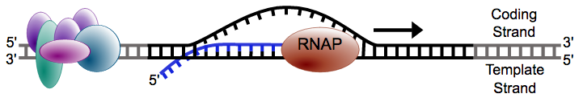

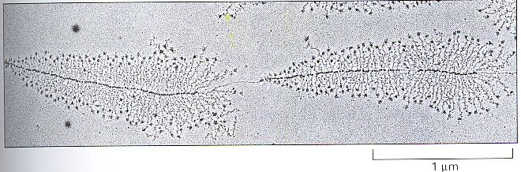

---

### Why measure RNA: 
### molecular phenotype

---

### Why measure RNA: 
### tissue diversity

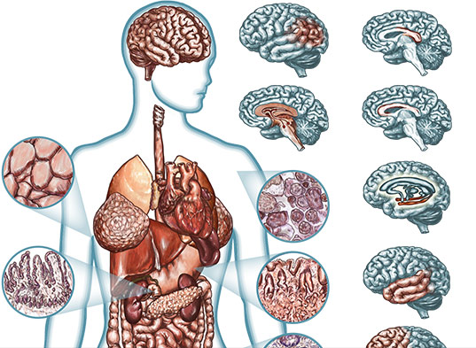

<small>[Roadmap Epigenomics](http://www.roadmapepigenomics.org)</small>

---

### Why measure RNA: 
### tissue diversity

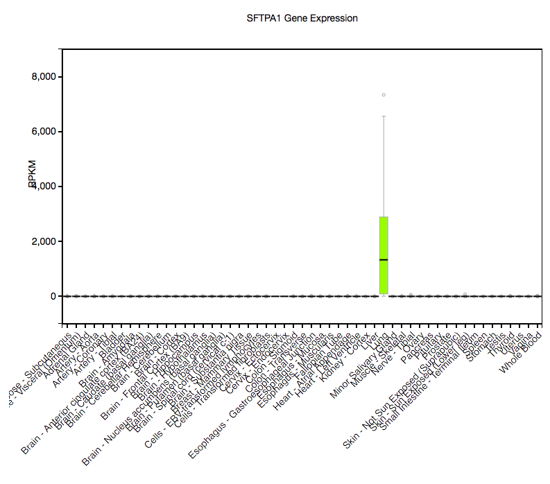

<small>[GTEx](http://www.gtexportal.org/home/)</small>

---

### Why measure RNA:
### within tissue over time

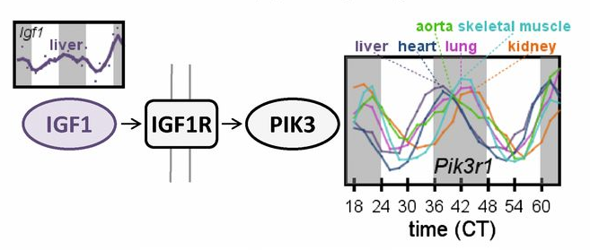

<small>[Zhang, et al. Circadian gene expression atlas (2014)](http://www.pnas.org/content/111/45/16219.full)</small>

---

### Why measure RNA: 
### discover disease sub-types

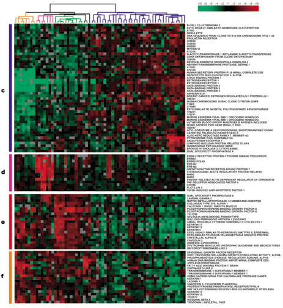

<small>[Perou, et al. Molecular portraits of human breast tumours (2000)](http://www.nature.com/nature/journal/v406/n6797/full/406747a0.html)</small>

---

### Step back: pre-sequencing

* Before sequencing was microarray
* Signal was captured light (positive, "continuous")

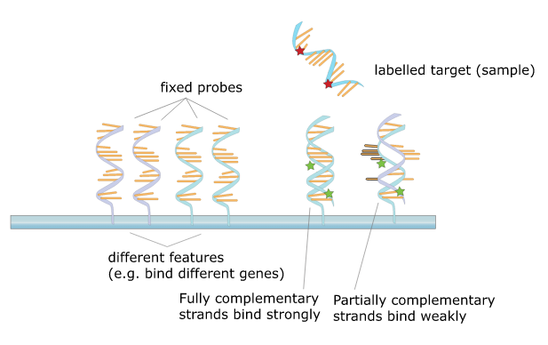 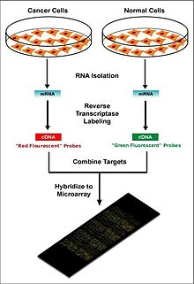

---

### Motivating problem

* Gene expression for *i*=1,...,N genes and *j*=1,...,M samples
* log of gene expression values are in a tall matrix X
* log here is convenient because gene expression is non-negative and has a
  long tail
* 2 equal sized groups of samples A and B

 

$$
\begin{align}
X_{ij} &\sim N(\mu_{ij}, \sigma_i) \\
\mu_{ij} &= \mu_{i0}, \quad j \in A \\
\mu_{ij} &= \mu_{i0} + \delta_i, \quad j \in B
\end{align}
$$

 

$\delta_i \ne 0$ implies DE (differential expression)

---

### Note $\sigma_i$

This is *critical*: different genes *i* have different amount of variability.

 

$$ 
\begin{align}
X_{ij} &\sim N(\mu_{ij}, \sigma_i) \\
\mu_{ij} &= \mu_{i0}, \quad j \in A \\
\mu_{ij} &= \mu_{i0} + \delta_i, \quad j \in B
\end{align}
$$

---

### Goal of differential expression testing

* Find a set of genes for which $\delta_i \ne 0$
* And which obeys false discovery rate bounds
* For G genes in our set at FDR threshold z

 

$$
E(\sum_i 1_{ \{\delta_i = 0\} }) \le G z
$$

---

### Is this realistic?

* Can we accomplish this if all $\delta_i \ne 0$
  - no, because methods rely on computational normalization
* Are any $\delta_i = 0$? 
  - maybe not, but many are very small for controlled experiment

---

### Is this realistic?

* What about $\sigma_i$ for both groups?
  - often this is enough, larger variance dominates
  - not for single cell experiments
* More complex parametric models: [baySeq](bioconductor.org/packages/baySeq)
* Non-parametric: [SAM / SAMseq](http://statweb.stanford.edu/~tibs/SAM/)

---

### Back to the model

$$
\begin{align}
X_{ij} &\sim N(\mu_{ij}, \sigma_i) \\
\mu_{ij} &= \mu_{i0}, \quad j \in A \\
\mu_{ij} &= \mu_{i0} + \delta_i, \quad j \in B
\end{align}
$$

 

* N = 5000, M = 6
* $\delta_i = 0$ for 90%
* $\delta_i = \pm1$ for 10%
* $\sigma_i \sim \Gamma(5,10)$ 

---

### Distribution of $\sigma_i$

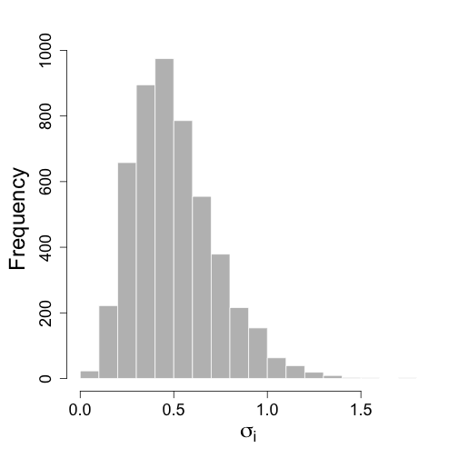

---

### Try simple row t-tests

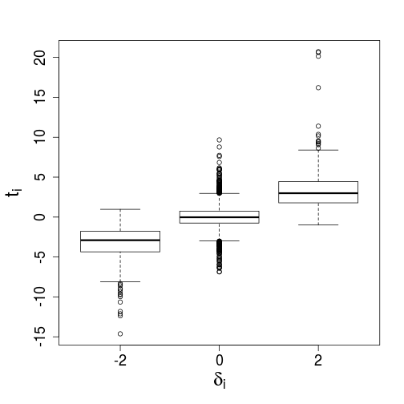

---

### Just looking at ranks

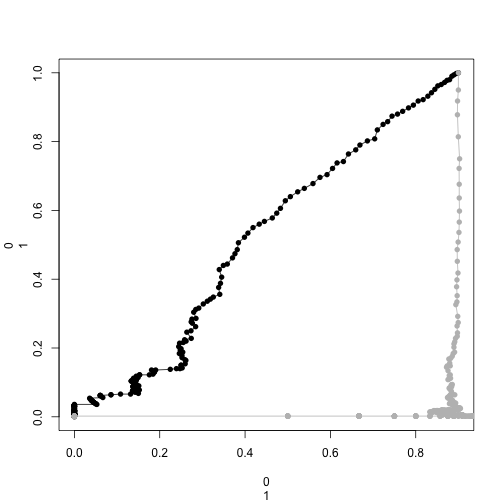

---

### Characterize the false positives

Call $\textrm{med}(t) \equiv \textrm{median}( \left| t_i \right| )$ for $i$ s.t. $\delta_i \ne 0$

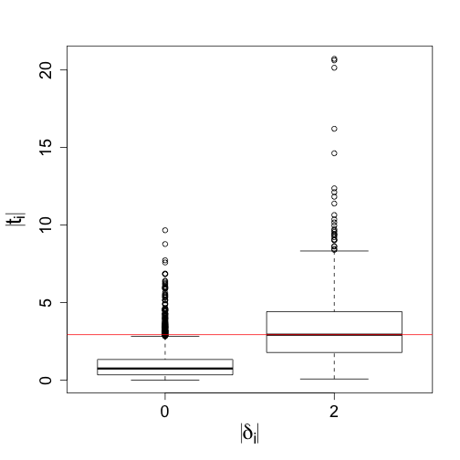

---

### Estimates of $\sigma_i$

$\textrm{med}(t) \equiv \textrm{median}( \left| t_i \right| )$ for $i$ s.t. $\delta_i \ne 0$

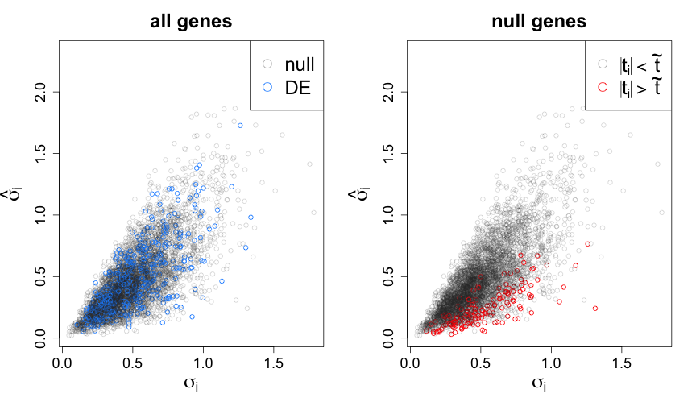

---

### New estimator for $\sigma_i$

$\bar{\sigma} = \frac{1}{N} \sum_{i=1}^N \hat{\sigma}_i$

$\tilde{\sigma}_i^B \equiv (1-B) \hat{\sigma}_i + B \bar{\sigma}$

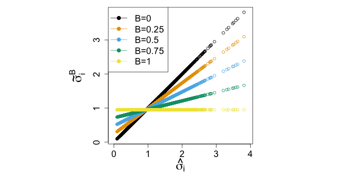

---

### How does new estimator perform

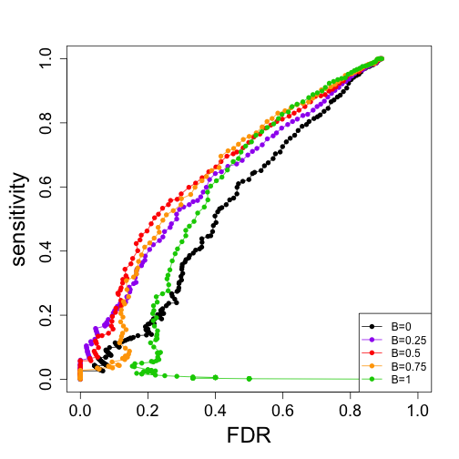

---

### Summary

* Top false positives were coming from genes with too low $\hat{\sigma}_i$
* Replace $\hat{\sigma}_i$ with an estimate which is closer to
  $\bar{\sigma}$
* Depending on "close", new estimator dominates at all thresholds
