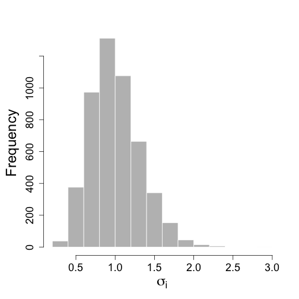
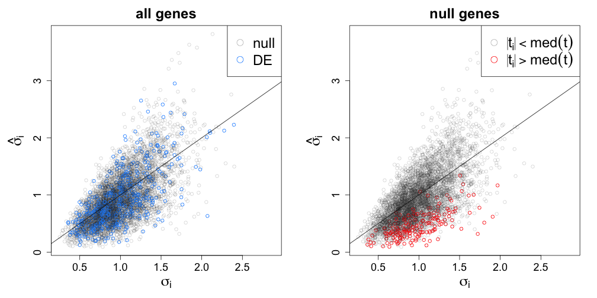
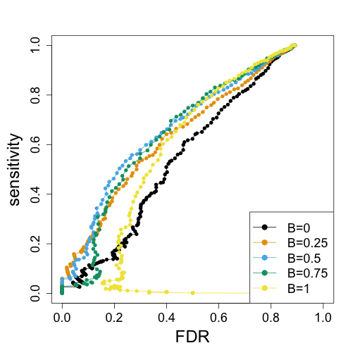
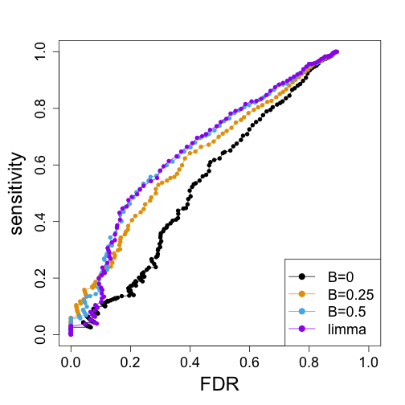
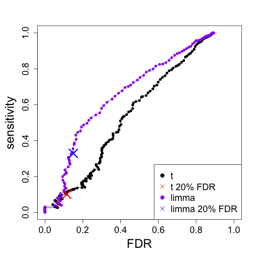

### Hierarchical Modeling for RNA-seq

Michael Love

Dept of Biostatistics

Dept of Genetics

---

### DNA => RNA


---

### Why measure RNA: 
### molecular phenotype


---

### Why measure RNA: 
### tissue diversity


<small>[Roadmap Epigenomics](http://www.roadmapepigenomics.org)</small>

---

### Why measure RNA: 
### tissue diversity


<small>[GTEx](http://www.gtexportal.org/home/)</small>

---

### Why measure RNA:
### within tissue over time


<small>[Zhang, et al. Circadian gene expression atlas (2014)](http://www.pnas.org/content/111/45/16219.full)</small>

---

### Why measure RNA: 
### discover disease sub-types


<small>[Perou, et al. Molecular portraits of human breast tumours (2000)](http://www.nature.com/nature/journal/v406/n6797/full/406747a0.html)</small>

---

### Step back: pre-sequencing

* Before sequencing was microarray
* Signal was captured light (positive, "continuous")

 


---

### Motivating problem

* Gene expression for *i*=1,...,N genes and *j*=1,...,M samples
* log of gene expression values are in a tall matrix X
* log here is convenient because gene expression is non-negative and has a
  long tail
* 2 equal sized groups of samples A and B

<br>

$$
\begin{aligned}
X_{ij} &\sim N(\mu_{ij}, \sigma_i) \\
\mu_{ij} &= \mu_{i0}, \quad j \in A \\
\mu_{ij} &= \mu_{i0} + \delta_i, \quad j \in B
\end{aligned}
$$

<br>

$\delta_i \ne 0$ implies DE (differential expression)

---

### Note $\sigma_i$

This is *critical*: different genes *i* have different amount of variability.

<br>

$$ 
\begin{aligned}
X_{ij} &\sim N(\mu_{ij}, \sigma_i) \\
\mu_{ij} &= \mu_{i0}, \quad j \in A \\
\mu_{ij} &= \mu_{i0} + \delta_i, \quad j \in B
\end{aligned}
$$

---

### Goal of differential expression testing

* Find a set of genes for which $\delta_i \ne 0$
* And which obeys false discovery rate bounds
* For genes in our set G at FDR threshold z

<br>

$$
E \left( \sum\nolimits_{i \in G} 1_{ \{\delta_i = 0\} } \right) \le
\left\vert G \right\vert z
$$

---

### Is this realistic?

* Can we accomplish this if all $\delta_i \ne 0$
  - no, because methods often rely on global scaling normalization
* Are any $\delta_i = 0$? 
  - maybe not, but many are very small for controlled experiment

---

### Is this realistic?

* What about $\sigma_i$ for both groups?
  - often this is enough, larger variance dominates
  - not for single cell experiments
* More complex parametric models: [baySeq](bioconductor.org/packages/baySeq)
* Non-parametric: [SAM / SAMseq](http://statweb.stanford.edu/~tibs/SAM/)

---

### Back to the model

$$
\begin{aligned}
X_{ij} &\sim N(\mu_{ij}, \sigma_i) \\
\mu_{ij} &= \mu_{i0}, \quad j \in A \\
\mu_{ij} &= \mu_{i0} + \delta_i, \quad j \in B
\end{aligned}
$$

<br>

* N = 5000, M = 6
* $\delta_i = 0$ for 90%
* $\delta_i = \pm2$ for 10%
* $\sigma_i \sim \Gamma(10,10)$ 

---

### Distribution of $\sigma_i$



---

### Try simple row t-tests


---

### Just looking at ranks

* Black = t-statistics, grey = random order, X = nominal FDR 20%


---

### Characterize the false positives

Call $\textrm{med}(t) \equiv \textrm{median}( \left| t_i \right| )$ for $i$ s.t. $\delta_i \ne 0$


---

### Estimates of $\sigma_i$

$\textrm{med}(t) \equiv \textrm{median}( \left| t_i \right| )$ for $i$ s.t. $\delta_i \ne 0$



---

### New estimator for $\sigma_i$

$\bar{\sigma} = \frac{1}{N} \sum_{i=1}^N \hat{\sigma}_i$

$\tilde{\sigma}_i^B \equiv B \bar{\sigma} + (1-B) \hat{\sigma}_i$


---

### New estimator performance by rank


---

### Summary

* Top false positives were coming from genes with too low $\hat{\sigma}_i$
* Replace $\hat{\sigma}_i$ with an estimate which is closer to
  $\bar{\sigma}$
* Depending on "close", new estimator dominates at all thresholds

---

### How is this hierarchical?

Not your standard diagram, need to formalize


---

### limma

* Smyth, G. K. (2004) Linear models and empirical Bayes methods for
assessing differential expression in microarray experiments 
[PDF](http://www.statsci.org/smyth/pubs/ebayes.pdf)
* Developed the hierarchical model introduced by Lonnstedt and Speed
  (2002) for single sample into method for any experiment represented
  as linear model

<br>

$$
\frac{1}{\sigma^2_i} \sim \frac{1}{d_0 \sigma_0^2} \chi_{d0}^2 
$$

<br>


---

### Why inverse $\chi^2$?

* Conjugacy provides closed form solution
* Posterior mean for $1/\sigma_i^2$ given $\hat{\sigma}_i^2$ is
  $1/\tilde{\sigma}_i^2$ with

<br>

$$
\tilde{\sigma}_i^2 = \frac{d_0 \hat{\sigma}_0^2 + d_i \hat{\sigma}_i^2}{d_0 + d_i} 
$$

And $d_i$ as the standard residual degrees of freedom

---

### Note that $d_0$ controls B

$$
\begin{aligned}
\tilde{\sigma}_i^2 &= \frac{d_0 \hat{\sigma}_0^2 + d_i
\hat{\sigma}_i^2}{d_0 + d_i}  \\
 &= \left( \frac{d_0}{d_0 + d_i} \right) \hat{\sigma}_0^2 +
\left( \frac{d_i}{d_0 + d_i} \right) \hat{\sigma}_i^2 \\
 &= B \hat{\sigma}_0^2 + (1-B) \hat{\sigma}_i^2
\end{aligned}
$$

---

### Proper hierarchical model


---

### Estimation of hyperparameters

* Need to estimate $d_0, \hat{\sigma}_0^2$, which control strength and
location of *shrinkage* or *moderation*
* $d_0, \hat{\sigma}_0^2$ estimated via first two moments of $\log \hat{\sigma}_i^2$
* (Also need to estimate $\upsilon_{0}$, another parameter giving
  variance of coefficients)

---

### limma vs. naive estimators by rank




---

### Rank is not the full picture

* limma also estimating degrees of freedom gained
* X = nominal FDR 20%




---

### RNA-seq: counting molecules

x

---

### RNA-seq: counting molecules

```
@SRR1265495.1 1/1
CTTTGCCCGCGTGTCAGACTCCATCCCTCCTCTGCCGCCACCGCAGCAGCCACAGGCAGAGGAGGACGAGGACGACTGGGAATCGTAGGGGGCTCCATGAC
+
CCCFFFFFHGFHHHIJJIJIJJIJJJJJJJGIIJJJIJJJJJJJJEFHDEFFFEECDDDBDD?BB?B@BDDD@;9<BBBDBCB@A2<?BDDDBDBD@CDDC
@SRR1265495.2 2/1
CCTGGCTGTGTCCATGTCAGAGCAATGGCCCAAGTCTGGGTCTGGGGGGGAAGGTGTCATGGAGCCCCCTACGATTCCCAGTCGTCCTCGTCCTCCTCTGC
+
@C@FFFDFHHHHGGIIAGHI9GIIIIIGIIIIIGI@@FHGDDDH@GGIBB05?B>ACCCCCCCB<?BBCCBBBBCBCDC3>AC<BB<?CBBB?<@CCCA:@
@SRR1265495.3 3/1
CTGTGTCCATGTCAGAGCAATGGCCCAAGTCTGGGTCTGGGGGGGAAGGTGTCATGGAGCCCCCTACGATTCCCAGTCGTCCTCGTCCTCCTCTGCCTGTG
+
@C@DFFFFGGHDHIIEGDHCGGHIJGEHIIJIIJIEEHGIGEGDDB@@@CDDDDEDDDDDBDDDDDDDDDBCCDDCCDBBDDDDDB@?@DDDDCDDCC@4>
```

for ~30 million reads (often pairs of reads)

---

### RNA-seq: align to genome or transcriptome


---

### RNA-seq: counting molecules

* Now for each gene and each sample we can obtain a *count*
  or *estimated count* of fragments
* Why estimated? Because some fragments cannot be uniquely associated
  with genes or isoforms
* Clever and fast algorithms for probabalistically assigning these
* Assume we have integer counts $K_{ij}$ of unique fragments or from 
  rounding estimated counts

---

### Counts

* Either model counts via count distributions and inference with GLM
* Learn weights associated with log counts

---

### Negative Binomial / Gamma Poisson

---

### Moderation of dispersion

